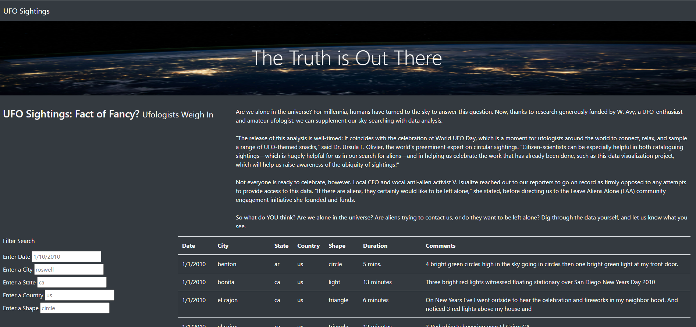
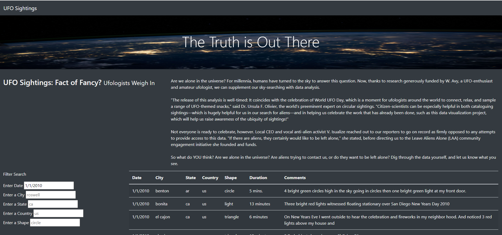
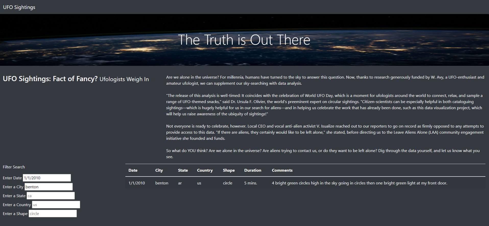
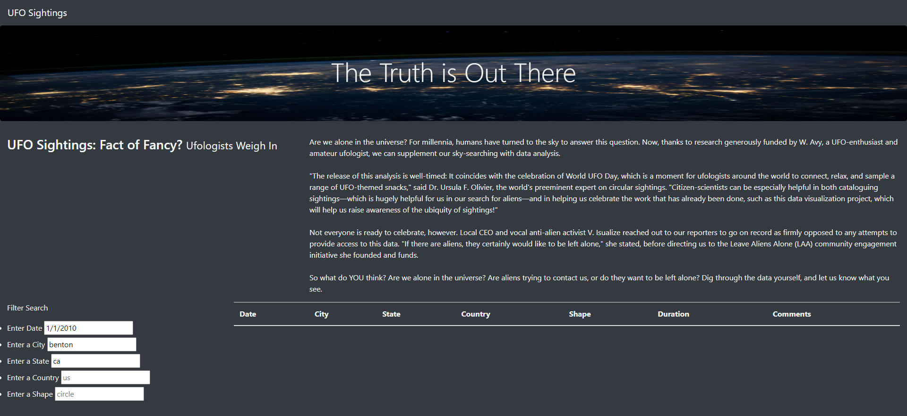
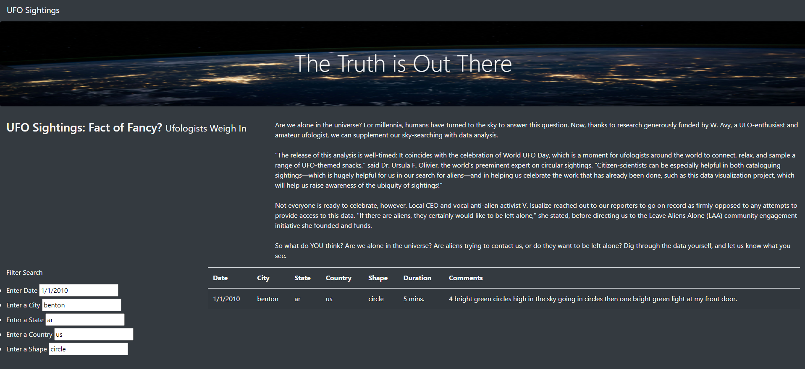

# UFOs

## Overview of the Project
This project aims to create a web page that allows the user to filter the data regarding relevant UFO Sightings. The data can be filter by date, city, state, country and shape.

## Results
This web page is really useful in order to filter the sightings based on different criteria. This section will explain step by step how to use the web page for this purpose.

When we navigate into the html file, this if how the web page looks like.

As we can observe there is a section that cointains 6 filters that will help the user narrow his search.Additionally we can see that each filter cointains a blueprint that tells the user the format needed to be enter.

So the first filter to be used is based on the date of the sighting. In this case we will create a hypothetic scenario where we want to obtain data for the 1st of January 2010, so following the blueprint we enter 1/1/2010 in the enter date filter. Once we enter this date on the filter, we can see that our data is reduced and only shows sightings for this specific date.

Next we will filter the data based on a specific city, for these example we will use "benton". So we enter this city name and we are able to see that the previous filter is maintained and the new city filter is added to it. So basically we are filtering our data on multiple criteria. The result obained is just on sighting. 

The next filter to be used is state. In this case we will filter by state "ar". So when entering this information in the filter section we should still continue seeing just 1 sighting. But if we enter another state, for example "ca" the webpage should not be able to display any sighting as there is not a sighting that fulfills with the 3 filters entered: date, city and state. The following image shows this second case, where there is not any data shown. 

For the 2 reimaining filters we will use "us" as the country and "circle" for the shape. In this case we will continue to use the previous filters mentioned before. So for date we will use 1/1/2010, for city "benton" and for state "ar". The output for this search is the following. 

## Summary

As we can see this webpage is really useful and interactive for the users. It allows them to filter information based on multiple criteria and this can be really helpful in finding specific sighting information. However it is also true that there are some limitations to this webpage. Eventough the data used to feed the page is very extensive, it will become obsolte at a certain point and the programer or the webpage has to continuosly update the information. 

In order to improve the webpage I would suggest to use real time information from a certain UFO sighting site, so that the data being dispalyed is always up to date. My second reccomendation would be to add links to videos or images related to different sitings so that the webpage is more atrractive to the user. Another idea would be to include a section where the user can filter on certain parameter and obtain graphs that show them in a more visual way the results for their search. For example being able to see the number of sighting per different country, number of sittings per shape during certain month, etc. 

